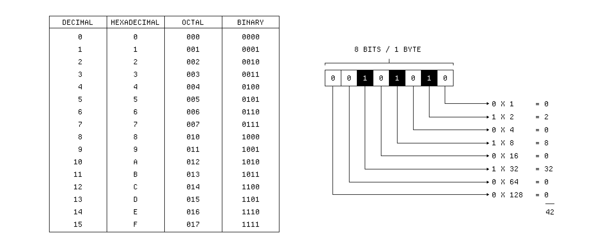

AI coding tools are not just faster autocomplete. They change the size of the unit a programmer can manipulate.

The question is whether that larger unit stays understandable. Speed without inspectability turns code into weather.



## Working Thought

The best systems will probably feel less like chat and more like controlled instruments.

```txt
intent -> patch -> review -> verification
```

The interface should preserve authorship, expose uncertainty, and keep the programmer close to the actual system.

## The Unit of Work Keeps Growing

For decades the unit of programming has been climbing a ladder of abstraction. We went from toggling individual bits, to assembly mnemonics, to statements, to functions, to libraries, to whole frameworks pulled in with a single import. Each rung let one person hold more of a system in their head at once, not because the system got smaller, but because the language for talking about it got denser.

AI coding tools are the next rung, and they are a strange one. For the first time the unit is not a fixed linguistic construct but an *intent* expressed in ordinary language. You no longer ask for a function; you ask for a behavior, and something downstream decides what functions, files, and edits that behavior implies. The compression is enormous. The risk is that the mapping from intent to artifact is no longer something you can fully see.

That invisibility is the whole problem in miniature. When the unit was a function, you could read the function. When the unit was a library, you could at least read its interface and trust its tests. When the unit becomes "make the checkout flow handle partial refunds," the thing you asked for and the thing that got built are separated by a layer of inference that does not announce its assumptions.

## Inspectability Is the Real Currency

Speed is the headline feature, but speed is not actually scarce. What is scarce is *trust that you understand what changed*. A change you cannot inspect is a liability no matter how quickly it arrived. This is why "it works on my machine" was never reassuring, and why "the model said it was done" is even less so.

There is a useful analogy with optimizing compilers. We trust an optimizing compiler to rewrite our code into something we would never read, because the contract is airtight: the observable behavior is preserved, and decades of testing back that promise. AI coding tools want the same trust but have not yet earned the same contract. They rewrite freely, but the guarantee that behavior is preserved is statistical at best.

So the design question is not "how do we make the model write more code faster," but "how do we make every change legible, reversible, and tied to a verifiable claim." Legibility means a human can read the diff and understand the intent behind it. Reversibility means a wrong step costs minutes, not days. Verifiability means there is an automatic check — a test, a type, a property — that fails loudly when the change is wrong.

## Three Properties Worth Designing For

The first is **authorship**. The programmer should remain the author of the system, not a spectator to it. That means the tool proposes and the human disposes; the human's mental model stays in sync with the code because they reviewed each consequential move. A tool that drifts ahead of its operator has stopped being an instrument and started being a black box.

The second is **uncertainty exposure**. Models are confident in tone regardless of whether they are right. A good interface should surface where the system is guessing: which assumptions it made, which parts are unverified, which edges it did not test. Hiding uncertainty behind a clean "Done ✓" is the most dangerous thing such a tool can do, because it converts a probabilistic output into something that reads as a certainty.

The third is **proximity**. The programmer should stay close to the actual system — the real files, the real tests, the real runtime — not a chat transcript that describes them. Distance breeds error. The closer the operator sits to the ground truth, the faster they notice when the map and the territory diverge.

## What This Looks Like in Practice

Concretely, the loop matters more than the model. A tight loop of intent, patch, review, and verification beats a powerful model wrapped in a loose loop. The model can be brilliant, but if its output lands in your codebase without a review surface and a failing-test safety net, the brilliance is wasted and the blast radius is unbounded.

```txt
intent -> patch -> review -> verification
              ^                     |
              |_____________________|
                  feedback loop
```

The feedback arrow is the important part. Each verification result should flow back into the next intent, so the system learns the shape of your codebase and you learn the shape of its mistakes. This is how a pair of human and tool converges instead of drifts.

## Where It Probably Goes

My guess is that the winning tools will feel less like talking to a clever assistant and more like operating a precise machine. Think of a CNC mill or a synthesizer: enormous capability, but every knob maps to an observable effect, and the operator builds intuition over time. The chat window is a fine onboarding ramp, but it is the wrong long-term interface for serious work, because conversation hides structure and serious work is structural.

The endgame is not the disappearance of the programmer. It is the programmer manipulating larger and larger units while keeping each unit inspectable. If we get that right, code stays something we understand. If we get it wrong, code becomes weather: powerful, omnipresent, and beyond our ability to reason about. The whole craft of the next decade is making sure it stays the former.
